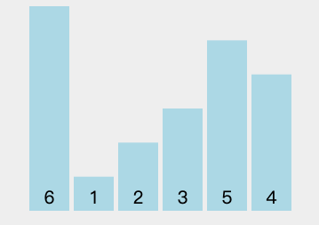

# 一、前言

今天，我们来看一下选择排序的核心算法思路以及代码实现。

---

# 二、内容


## 2.1 思路

选择排序的思路就是将数组视为两部分：**已排序区间和未排序区间**。然后，在未排序区间中找到最小元素，放到已排序区间的起始位置，再从剩余未排序区间元素中继续寻找最小元素，再放到已排序区间的末尾。以此类推，直到所有元素均排序完毕。

见下图：


简单地说，选择排序就是**遍历数组，找到最小元素，存放到数组的起始位置。然后再从剩下的元素中继续寻找最小元素，再放到数组的第二个位置**，以此类推。

选择排序算法动图演示如下：




> 备注：选择排序.gif 摘自力扣（LeetCode）官方知乎账号

## 2.2 步骤

假设待排序数组 `arr` 的元素个数为 `n` 。

选择排序的步骤如下：

1.  初始时，将整个数组视为未排序区间。同时已排序区间为空，已排序区间末尾位置的下标 `i` 指向 0；
2.  接着，在未排序区间中找到最小的元素，我们用 `minIndex` 来记录当前未排序区间中最小元素的下标。
3.  将找到的最小元素添加到已排序区间的末尾位置，即 `swap(arr, i, minIndex)`。
4.  将已排序区间的末尾扩展一个元素，也就是 `i++`，此时继续去未排序区间中寻找当前最小值元素，再将其添加到已排序区间的末尾位置，以此类推。
5.  直到未排序区间变为空，已排序区间变成整个数组。

具体的，我们用两层for循环来模拟：

*   外层循环中，循环变量 `i` 从`0` 遍历到 `n-2`，表示已排序区间的末尾位置的下标
*   内层循环中，循环变量 `j` 从 `i+1` 遍历到 `n-1`，用于遍历待排序部分的元素，找到最小值。
*   当我们在内层循环中找到当前待排序部分的最小值元素后，将其赋给 `arr[i]`，表示将最小值元素添加到已排好序的序列的末尾。
*   逐渐的，已排好序的序列末尾会是一个递增的趋势。

## 2.3 代码

首先说明，在代码中会使用到自定义的 `swap()`，该方法将数组中指定下标的两个数据元素进行交换操作。定义如下：

```java
public static void swap(int[] arr, int i, int j) {
    int tmp = arr[i];
    arr[i] = arr[j];
    arr[j] = tmp;
}
```

下面是选择排序算法的Java代码实现。

**无注释**版本代码：

```java
public static void selectionSort(int[] arr) {
    int n = arr.length;
    if (arr == null || n < 2) {
        return;
    }
    for (int i = 0; i <= n-2; i++) {
        int minIndex = i;
        for (int j = i+1; j <= n-1; j++) {
            minIndex = arr[j] < arr[minIndex] ? j : minIndex;
        }
        swap(arr, i, minIndex);
    }
}
```

**有注释**版本代码：

```java
public static void selectionSort(int[] arr) {
    
    // 数组的长度为 n
    int n = arr.length;
    
    // 处理特殊情况
    if(arr == null || n < 2) {
        return;
    }
    
    // i 指向当前已排序区间的末尾位置
    for(int i = 0; i <= n-2; i++) {
        
        // 在未排序区间中寻找最小元素的下标，并记录到 minIndex 中
        int minIndex = i;
        
        // j 用于遍历未排序区间
        for(int j = i+1; j <= n-1; j++) {
            
            // 寻找最小值元素的下标
            minIndex = arr[j] < arr[minIndex] ? j : minIndex;
            
        }
        
        // 在每轮遍历完未排序区间后，
        // minIndex 指向的就是未排序区间中最小元素的下标，
        // 将其指向的数据元素放到已排好序的序列的末尾
        // 也就是将 arr[i] 与 arr[minIndex] 进行交换
        swap(arr, i, minIndex); 
    }
}
```

---


# 三、总结

我们来总结一下选择排序：

选择排序是一种简单的排序算法，其核心思想是**将待排序的数组分为已排序区间和未排序区间，然后在未排序区间中选择最小的元素，将其添加到已排序区间的末尾**，依此类推，直到整个数组变成有序状态。

这样，整个数组就从无序序列变成一个递增序列。

> 备注：如果想得到一个递减的序列，就在每一次未排序区间中进行元素选择时，选取最大的元素，这样就可以逐渐将最大的元素添加到已排序区间的末尾，得到一个递减的序列。