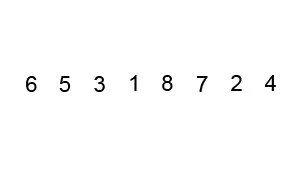

# 一、前言

今天，我们来看一下冒泡排序的核心算法思路以及代码实现。

---

# 二、内容

## 2.1 思路

冒泡排序的思路就是，不断比较相邻的元素并交换它们的位置，使较大的元素逐渐“浮”到数组的一端。这个过程重复进行，直到整个数组有序。

演示动图如下：



冒泡排序的核心思想可以概括为以下几个步骤：

1. 从数组的第一个元素开始，依次比较相邻的两个元素。
2. 如果发现顺序不对（例如，前一个元素大于后一个元素），就交换它们的位置。
3. 继续重复步骤 1 和 2，直到没有任何交换发生，此时数组已经排好序。

## 2.2 步骤

具体而言，冒泡排序的步骤如下：

1. 从数组的第一个元素开始，将其视为当前未排序区间的唯一元素。
2. 比较当前元素和下一个元素。
3. 如果当前元素大于下一个元素，交换它们的位置。
4. 移动到下一个元素，继续比较和交换，直到达到未排序区间的末尾。
5. 此时，最大的元素已经“浮”到了未排序区间的末尾。
6. 重复上述步骤，但忽略最后一个已排序元素，因为它已经在正确的位置上。
7. 继续重复这个过程，直到没有任何交换发生，整个数组变得有序。

## 2.3 代码

下面是冒泡排序的Java代码实现：

> 外层循环控制比较的轮数（从后往前逐渐缩小范围），内层循环在每一轮中比较相邻元素并执行交换操作。这个排序算法在每一轮中将最大的元素“冒泡”到未排序区间的末尾，逐渐完成排序。

```java
public static void bubbleSort(int[] arr) {
    int n = arr.length;
    if (arr == null || n < 2) {
        return; // 如果数组为空或只有一个元素，不需要排序，直接返回
    }
    for (int i = n - 1; i >= 1; i--) {	// 外层循环，控制需要比较的轮数
        for (int j = 0; j < i; j++) {	// 内层循环，比较相邻元素
            if (arr[j] > arr[j + 1]) {	// 如果前一个元素大于后一个元素，交换它们的位置
                swap(arr, j, j + 1);	
            }
        }
    }
}

private static void swap(int[] arr, int i, int j) {
    // 辅助方法，用于交换数组中指定下标的两个元素
    int temp = arr[i];
    arr[i] = arr[j];
    arr[j] = temp;
}
```

冒泡排序是一种简单的排序算法，其时间复杂度为O(n^2)，其中n是数组的长度。由于它需要比较和交换相邻元素，因此在大规模数据集上不是最有效的排序算法。然而，对于小型数据集来说，冒泡排序可能是一个合理的选择。


# 三、总结

总的来说，冒泡排序是一种简单（但并不高效）的排序算法。它的核心思想是通过不断比较和交换相邻元素，使较大（或较小）的元素逐渐“浮”到数组的一端，直到整个数组有序。尽管冒泡排序的时间复杂度较高，但它在某些情况下仍然有用，比如对于小型数据集。

