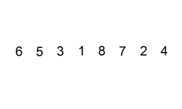

# 一、前言

在前两篇文章中，我们已经介绍了一些简单的排序算法，如选择排序、冒泡排序。今天，我们探讨另一种常见的简单排序算法——插入排序。

插入排序是一种直观且容易理解的排序算法，它的核心思想是将未排序的元素逐个插入到已排序的部分，以构建有序数组。

# 二、内容

## 2.1 思路

插入排序的思路非常直观，它模仿我们在现实生活中玩扑克牌的方式。当你拿到一副乱序的扑克牌，你会将每张牌插入到已经有序的手牌中，以确保手牌始终有序。插入排序的核心思想可以概括为以下几个步骤：

1. 从数组的第二个元素开始，将其视为当前未排序区间的唯一元素。
2. 比较当前元素与已排序区间的元素。
3. 如果当前元素小于已排序区间的元素，将当前元素插入到适当的位置，同时将已排序区间的元素向后移动。
4. 重复上述步骤，逐个将未排序区间的元素插入到已排序区间，直到整个数组有序。

演示动图如下：



## 2.2 步骤

具体而言，插入排序的步骤如下：

1. 从数组的第二个元素开始，将其暂存为当前元素。
2. 将当前元素与已排序区间的最后一个元素进行比较。
3. 如果当前元素小于已排序区间的元素，将已排序区间的元素向后移动，直到找到当前元素应插入的位置。
4. 将当前元素插入到适当的位置。
5. 继续取下一个未排序区间的元素，重复上述过程，直到整个数组有序。

## 2.3 代码

下面是插入排序的Java代码实现：

> 同样使用两个for循环，将未排序的元素逐个插入到已排序的部分，以构建有序数组。

```java
public static void insertionSort(int[] arr) {
    if (arr == null || arr.length < 2) {
        return; // 如果数组为空或只有一个元素，无需排序
    }
    // 从第二个元素开始，依次插入到已排序区间
    for (int i = 1; i < arr.length; i++) {
        // 通过内层循环进行比较和交换元素，直到找到适当的插入位置
        for (int j = i - 1; j >= 0 && arr[j] > arr[j + 1]; j--) {
            swap(arr, j, j + 1);
        }
    }
}
private static void swap(int[] arr, int i, int j) {
    // 辅助方法，用于交换数组中指定下标的两个元素
    int temp = arr[i];
    arr[i] = arr[j];
    arr[j] = temp;
}
```

插入排序是一种稳定的排序算法，它的时间复杂度为O(n^2)，其中n是数组的长度。与冒泡排序一样，插入排序也适用于小型数据集，但在某些情况下，它比冒泡排序更加高效。


# 三、总结

插入排序是一种直观且容易理解的排序算法，它的核心思想是将未排序的元素逐个插入到已排序的部分，以构建有序数组。尽管它的时间复杂度相对较高，但在某些情况下，特别是对于小型数据集，插入排序是一个合理的选择。

